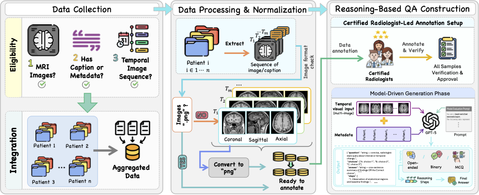
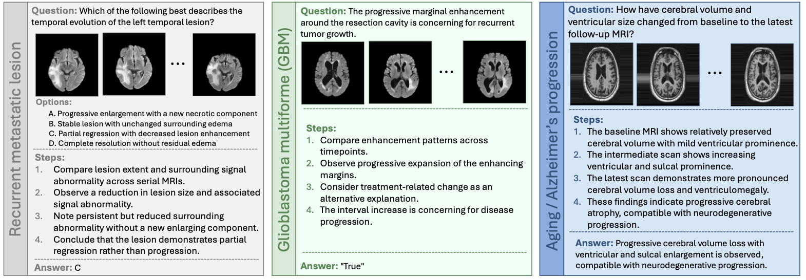

<div align="center">

# 🧠 How Good are Foundation Models in Longitudinal MRI Disease Progression Reasoning?

### Time-Aware Multi-View MRI Benchmark   [🔥 MICCAI 2026]

[Wafa Al Ghallabi](https://scholar.google.com/citations?user=m0ez8X8AAAAJ)¹ &nbsp; · &nbsp; 
[Ritesh Thawkar](https://in.linkedin.com/in/ritesh-thawkar-b13192233)¹ &nbsp; · &nbsp; 
[Sara Ghaboura](https://huggingface.co/SLMLAH)¹ &nbsp; · &nbsp;
[Omkar Thawakar](https://scholar.google.com/citations?user=flvl5YQAAAAJ)¹ &nbsp; · &nbsp; 
[Numan Saeed](https://scholar.google.com/citations?user=VHRDcusAAAAJ)¹

[Dana Al Nuaimi](#)² &nbsp; · &nbsp;
[Ajnas Alkatheeri](#)³ &nbsp; · &nbsp;
[Salman Khan](https://salman-h-khan.github.io/)¹ &nbsp; · &nbsp;
[Fahad Shahbaz Khan](https://sites.google.com/view/fahadkhans/home)¹,⁴

¹ Mohamed bin Zayed University of Artificial Intelligence (MBZUAI) &nbsp; · &nbsp;
² Department of Health Abu Dhabi &nbsp; · &nbsp;
³ Fatima College of Health Sciences &nbsp; · &nbsp;
⁴ Linköping University

[](#)
[](#)
[](#)
[](#)
[](LICENSE)
[](https://github.com/wafaAlghallabi/Time-Aware-MRI/stargazers)

</div>

---

> **TL;DR.** We introduce the **Time-Aware Multi-View MRI Benchmark** — the first large-scale evaluation suite that probes vision-language models on *longitudinal*, *multi-view*, *clinically grounded* MRI reasoning. The benchmark covers **3,920 expert-verified QA pairs** from **890 patients** across **3,200+ timepoints** and **7 cohorts**, spanning **glioblastoma, brain metastases, neurodegeneration, and vestibular schwannoma**. We evaluate **16 VLMs** (closed- and open-source) and find that even state-of-the-art systems systematically fail on clinically critical change-direction recognition.

---

## 📢 Latest Updates

- 🌟 **[August 2026]** Paper selected for a **Spotlight Presentation** — see you in Strasbourg, France! 🇫🇷
- 🏆 **[May 2026]** Paper **Early Accepted** at **MICCAI 2026** (top 9%).
- 🔥 **[May 2026]** Code, evaluation scripts and preprocessing scripts released.
- 🤗 **[Coming soon]** Benchmark on Hugging Face.

---

## ✨ Key Highlights

- 🧠 **First longitudinal multi-view MRI benchmark** for foundation models — unifies temporal reasoning, multi-view anatomical input, and structured localization guidance.
- 🏥 **Clinically grounded**: 7 expert cohorts spanning glioblastoma, brain metastases, neurodegeneration, and vestibular schwannoma — dual-radiologist verified.
- 📊 **3,920 expert-verified QA pairs** across 5 task families (open-ended, multiple-choice, and binary formats).
- 🤖 **16 VLMs evaluated** — including GPT-4o, GPT-5.2, o4-mini, Gemini-2.5/3 Pro & Flash, Qwen3-VL, Llama-4 Scout/Maverick, InternVL3.5, and MedGemma variants.
- 📐 **New TAC metric** — Time-Aware Composite jointly scores temporal consistency, change characterisation, and structural reasoning fidelity.
- 🔬 **Multi-view ablation** — agentic Resident-Attending protocol isolates the effect of multi-view vs axial-only input on spatial localization and temporal reasoning.

---

## 📋 Overview

Real-world radiology is **comparative and longitudinal**: radiologists assess disease progression by aligning current and prior scans across multiple anatomical views and sequences. Yet most medical VLM benchmarks remain confined to single-timepoint, single-view interpretation.

The **Time-Aware Multi-View MRI Benchmark** addresses this gap through a unified pipeline that integrates longitudinal MRI data, multi-view extraction, expert-guided question generation, and radiologist verification.

<p align="center">
  
</p>

<p align="center">
  <em>Overview of the Time-Aware Multi-View MRI Benchmark pipeline, from longitudinal data selection and multi-view extraction to expert-guided QA generation and radiologist verification.</em>
</p>

The benchmark evaluates five complementary tasks:

| # | Task | Format | # QA Pairs | What it tests |
|---|---|---|---|---|
| 1 | **Temporal Reasoning** | Open-ended | 1,101 | Interval change identification across timepoints |
| 2 | **Disease Progression** | Open-ended | 942 | Trajectory and treatment-response prediction |
| 3 | **Structured Localization Guidance** | MCQ | 828 | Anatomical change regions + boundaries + features |
| 4 | **Temporal Sequence Ordering** | Binary | 487 | Chronological reconstruction of serial scans |
| 5 | **Change Localization Over Time** | MCQ | 562 | Maximal-change timepoints and locations |

<p align="center">
  
</p>

<p align="center">
  <em>Representative benchmark samples illustrating longitudinal MRI reasoning across different pathologies and task formats.</em>
</p>

---

## 🏆 Benchmark Statistics

| Metric | Value |
|---|---|
| 🧑‍⚕️ Patients | 890 |
| 📅 Longitudinal timepoints | 3,200+ |
| 🩻 Cohorts | 7 |
| ❓ Expert-verified QA pairs | 3,920 |
| 🖼 Sequences | T1, T2, FLAIR, T1CE, DWI, ADC |
| 📐 Views per timepoint | Axial, Coronal, Sagittal (9–12 images) |
| ⏱ Inter-scan intervals | 4 months → 18+ months |
| 👩‍⚕️ Reviewers | 2 board-certified radiologists |
| ✅ Acceptance rate | 72% (dual-approved) |

---

## 📦 Dataset

The benchmark is built on **seven publicly available longitudinal MRI cohorts**, harmonised with a unified preprocessing pipeline (registration → multi-view extraction → sequence-specific intensity normalisation → quality control).

### 🩻 Source Cohorts

| Cohort | Pathology | Access |
|---|---|---|
| **Yale-Brain-Mets-Longitudinal** | Brain metastases | [TCIA](https://www.cancerimagingarchive.net/collection/yale-brain-mets-longitudinal/) |
| **UCSF-ALPTDG** | Post-treatment diffuse glioma | [DOI 10.1148/ryai.230182](https://doi.org/10.1148/ryai.230182) |
| **UCSD-PTGBM** | Post-treatment glioblastoma (MGMT/IDH) | [TCIA](https://www.cancerimagingarchive.net/collection/ucsd-ptgbm/) |
| **LUMIERE** | Longitudinal glioblastoma + RANO | [Figshare](https://doi.org/10.6084/m9.figshare.c.5904905) |
| **OASIS-2** | Neurodegeneration (longitudinal) | [oasis-brains.org](https://www.oasis-brains.org/) |
| **ADNI** | Alzheimer's disease neuroimaging | [adni.loni.usc.edu](https://adni.loni.usc.edu/) |
| **Vestibular-Schwannoma-MC-RC** | Vestibular schwannoma follow-up | [TCIA](https://www.cancerimagingarchive.net/collection/vestibular-schwannoma-mc-rc/) |


## ⚙️ Installation

```bash
# 1. Clone the repository
git clone https://github.com/wafaAlghallabi/Time-Aware-MRI.git
cd Time-Aware-MRI

# 2. Create a conda environment
conda create -n time-aware-mri python=3.10 -y
conda activate time-aware-mri

# 3. Install dependencies
pip install -r requirements.txt
```
---
## 📊 Main Results — Table 1

**Performance of 16 VLMs on the Time-Aware Multi-View MRI Benchmark.** Higher TAC indicates stronger temporal consistency and reasoning fidelity. **Bold** = best per column.

| Model | Final Acc (%) | RS | TAC | TEDS | Trend F1 | Sign Acc | Coverage | Chronology |
|---|---:|---:|---:|---:|---:|---:|---:|---:|
| **Closed-source** | | | | | | | | |
| o4-mini | 32.18 | 6.68 | 0.753 | 0.832 | 0.548 | 0.681 | 0.908 | 0.918 |
| GPT-4o | 32.00 | 6.26 | 0.731 | 0.807 | 0.546 | 0.654 | 0.877 | 0.917 |
| GPT-5.2 | 21.20 | 5.83 | 0.661 | 0.805 | 0.192 | 0.639 | **0.921** | 0.856 |
| Gemini-2.5-Flash | 23.57 | 5.83 | 0.692 | 0.780 | 0.477 | 0.596 | 0.875 | 0.825 |
| Gemini-2.5-Pro | 23.66 | 5.88 | 0.672 | 0.785 | 0.504 | 0.528 | 0.730 | 0.957 |
| Gemini-3-Flash | 22.30 | 5.17 | 0.577 | 0.764 | 0.216 | 0.470 | 0.575 | **1.000** |
| Gemini-3-Pro | 35.10 | 5.31 | 0.590 | 0.775 | 0.235 | 0.485 | 0.600 | 0.980 |
| **Open-source** | | | | | | | | |
| **InternVL3.5-Inst** | **35.15** | **6.68** | **0.800** | **0.870** | **0.631** | **0.740** | 0.903 | 0.951 |
| Qwen3-VL-Plus-Thinking | 28.38 | 6.54 | 0.733 | 0.812 | 0.558 | 0.659 | 0.835 | 0.830 |
| Qwen3-VL-235B-Thinking | 30.37 | 6.55 | 0.742 | 0.815 | 0.571 | 0.674 | 0.852 | 0.825 |
| Qwen3-VL-8B-Inst | 24.31 | 6.05 | 0.732 | 0.801 | 0.557 | 0.655 | 0.888 | 0.825 |
| Llama-4-Scout-17B-Inst | 28.47 | 5.78 | 0.708 | 0.810 | 0.485 | 0.601 | 0.860 | 0.870 |
| Llama-4-Maverick-17B-Inst | 26.84 | 5.85 | 0.690 | 0.779 | 0.505 | 0.574 | 0.846 | 0.661 |
| MedGemma-27B-IT | 19.13 | 5.04 | 0.602 | 0.696 | 0.280 | 0.523 | 0.936 | 0.645 |
| MedGemma-1.5-4B-IT | 21.80 | 4.81 | 0.587 | 0.706 | 0.262 | 0.472 | 0.873 | 0.749 |
| MedGemma-4B-IT | 23.50 | 4.58 | 0.572 | 0.717 | 0.245 | 0.421 | 0.809 | 0.854 |

---

## 🙏 Acknowledgments

This work was made possible by the openly released longitudinal MRI cohorts listed in the [Dataset](#-dataset) section. We thank the data contributors at **UCSF**, **UCSD**, **Yale**, **University Hospital Bern (LUMIERE)**, **OASIS**, **ADNI**, and the **Vestibular-Schwannoma-MC-RC consortium**. We also thank the two board-certified radiologists who provided dual review for every QA pair.

---

## 📝 Citation

If you find this benchmark useful in your research, please cite our work:

```bibtex
@inproceedings{alghallabi2026timeaware,
  title     = {How Good are Foundation Models in Longitudinal MRI Disease Progression Reasoning?},
  author    = {Al Ghallabi, Wafa and Thawkar, Ritesh and Ghaboura, Sara and
               Thawakar, Omkar and Saeed, Numan and Al Nuaimi, Dana and
               Alkatheeri, Ajnas and Khan, Salman and Khan, Fahad Shahbaz},
  booktitle = {Medical Image Computing and Computer Assisted Intervention -- MICCAI 2026},
  year      = {2026},
  publisher = {Springer}
}
```

---

## 📧 Contact

For questions, issues, or collaborations, please open an [issue](https://github.com/wafaAlghallabi/Time-Aware-MRI/issues) or reach out to:

**Wafa Al Ghallabi** — `wafa.alghallabi@mbzuai.ac.ae`

---
